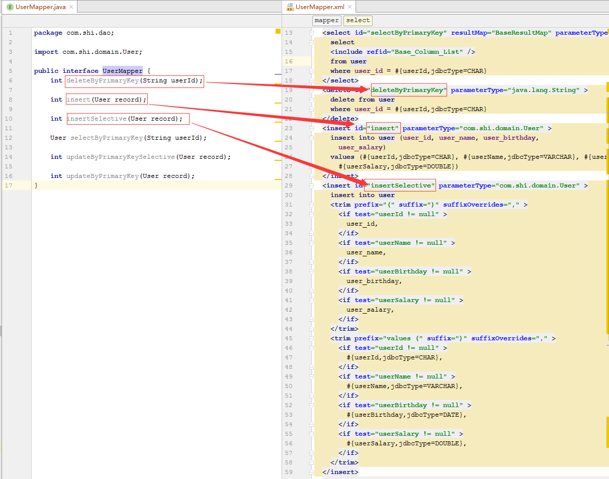

MyBatis学习总结(八)——Mybatis3.x与Spring4.x整合

>[github同步更新](https://github.com/AFinalStone?tab=repositories)
[博客同步更新](http://blog.csdn.net/abc6368765)
[简书同步更新](http://www.jianshu.com/u/0e4907a8f36b)
[参考原文地址](http://www.cnblogs.com/xdp-gacl/p/4261895.html)
项目地址:[传送门](https://github.com/AFinalStone/MyBatis)

#### 一、搭建开发环境
1.1、使用IDEA新建一个项目，项目结构如下：

   

其中用到的pox.xml内容：

```xml
<project xmlns="http://maven.apache.org/POM/4.0.0" xmlns:xsi="http://www.w3.org/2001/XMLSchema-instance"
  xsi:schemaLocation="http://maven.apache.org/POM/4.0.0 http://maven.apache.org/maven-v4_0_0.xsd">
  <modelVersion>4.0.0</modelVersion>
  <groupId>com.shi</groupId>
  <artifactId>spring4-mybatis3</artifactId>
  <packaging>war</packaging>
  <version>1.0-SNAPSHOT</version>
  <name>spring4-mybatis3</name>
  <url>http://maven.apache.org</url>
  <dependencies>
    <!-- 添加Spring-core包 -->
    <dependency>
      <groupId>org.springframework</groupId>
      <artifactId>spring-core</artifactId>
      <version>4.1.4.RELEASE</version>
    </dependency>
    <!-- 添加spring-context包 -->
    <dependency>
      <groupId>org.springframework</groupId>
      <artifactId>spring-context</artifactId>
      <version>4.1.4.RELEASE</version>
    </dependency>
    <!-- 添加spring-tx包 -->
    <dependency>
      <groupId>org.springframework</groupId>
      <artifactId>spring-tx</artifactId>
      <version>4.1.4.RELEASE</version>
    </dependency>
    <!-- 添加spring-jdbc包 -->
    <dependency>
      <groupId>org.springframework</groupId>
      <artifactId>spring-jdbc</artifactId>
      <version>4.1.4.RELEASE</version>
    </dependency>
    <!-- 为了方便进行单元测试，添加spring-test包 -->
    <dependency>
      <groupId>org.springframework</groupId>
      <artifactId>spring-test</artifactId>
      <version>4.1.4.RELEASE</version>
    </dependency>
    <!--添加spring-web包 -->
    <dependency>
      <groupId>org.springframework</groupId>
      <artifactId>spring-web</artifactId>
      <version>4.1.4.RELEASE</version>
    </dependency>
    <!--添加aspectjweaver包 -->
    <dependency>
      <groupId>org.aspectj</groupId>
      <artifactId>aspectjweaver</artifactId>
      <version>1.8.5</version>
    </dependency>
    <!-- 添加mybatis的核心包 -->
    <dependency>
      <groupId>org.mybatis</groupId>
      <artifactId>mybatis</artifactId>
      <version>3.2.8</version>
    </dependency>
    <!-- 添加mybatis与Spring整合的核心包 -->
    <dependency>
      <groupId>org.mybatis</groupId>
      <artifactId>mybatis-spring</artifactId>
      <version>1.2.2</version>
    </dependency>
    <!-- 添加servlet3.0核心包 -->
    <dependency>
      <groupId>javax.servlet</groupId>
      <artifactId>javax.servlet-api</artifactId>
      <version>3.0.1</version>
    </dependency>
    <dependency>
      <groupId>javax.servlet.jsp</groupId>
      <artifactId>javax.servlet.jsp-api</artifactId>
      <version>2.3.2-b01</version>
    </dependency>
    <!-- jstl -->
    <dependency>
      <groupId>javax.servlet</groupId>
      <artifactId>jstl</artifactId>
      <version>1.2</version>
    </dependency>
    <!-- 添加mysql驱动包 -->
    <dependency>
      <groupId>mysql</groupId>
      <artifactId>mysql-connector-java</artifactId>
      <version>5.1.34</version>
    </dependency>
    <!-- 添加druid连接池包 -->
    <dependency>
      <groupId>com.alibaba</groupId>
      <artifactId>druid</artifactId>
      <version>1.0.12</version>
    </dependency>
    <!-- 添加junit单元测试包 -->
    <dependency>
      <groupId>junit</groupId>
      <artifactId>junit</artifactId>
      <version>4.12</version>
      <scope>test</scope>
    </dependency>
  </dependencies>
  <build>
    <finalName>spring4-mybatis3</finalName>
    <plugins>
      <plugin>
        <groupId>org.mybatis.generator</groupId>
        <artifactId>mybatis-generator-maven-plugin</artifactId>
        <version>1.3.2</version>
        <configuration>
          <verbose>true</verbose>
          <overwrite>true</overwrite>
        </configuration>
      </plugin>
    </plugins>
  </build>
</project>
```
pox.xml主要分两大部分，上面的10行-111行主要是为了添加项目jar包依赖，下面的114行-124行主要是为了集成generator插件(可以通过映射数据库表字段生成实体类)；
添加pox.xml文件只有，在IDEA的右侧打开Maven Projects模块，点击左上方的刷新控件，刷新整个项目。

1.2、右键项目，选择open module setting，点击左上角的+符号，选择maven，添加generator插件


#### 二、创建数据库和表(针对MySQL)

2.1 在MySQL数据库中执行如下SQL语句：

```mysql

Create DATABASE spring4_mybatis3;
USE spring4_mybatis3;

DROP TABLE IF EXISTS user;
CREATE TABLE user (
  user_id char(32) NOT NULL,
  user_name varchar(30) DEFAULT NULL,
  user_birthday date DEFAULT NULL,
  user_salary double DEFAULT NULL,
  PRIMARY KEY (user_id)
) ENGINE=InnoDB DEFAULT CHARSET=utf8;

```


#### 三、使用generator生成数据库映射代码

2.2 手动创建【src/main/resources】、【src/main/java】、【src/test/resources】、【src/test/java】这几个source folder，如下图所示：


2.3 在main/resources中添加generatorConfig.xml文件

```xml

<?xml version="1.0" encoding="UTF-8"?>
<!DOCTYPE generatorConfiguration PUBLIC "-//mybatis.org//DTD MyBatis Generator Configuration 1.0//EN" "http://mybatis.org/dtd/mybatis-generator-config_1_0.dtd">
<generatorConfiguration>
    <!-- 数据库驱动包位置 -->
    <classPathEntry location="D:\Java\IdeaProjects\MyBatis\lib\mysql-connector-java-5.1.7-bin.jar" />
    <!-- <classPathEntry location="C:\oracle\product\10.2.0\db_1\jdbc\lib\ojdbc14.jar" />-->
    <context id="DB2Tables" targetRuntime="MyBatis3">
        <commentGenerator>
            <property name="suppressAllComments" value="true" />
        </commentGenerator>
        <!-- 数据库链接URL、用户名、密码 -->
        <jdbcConnection driverClass="com.mysql.jdbc.Driver" connectionURL="jdbc:mysql://localhost:3306/spring4_mybatis3" userId="root" password="123456">
            <!--<jdbcConnection driverClass="oracle.jdbc.driver.OracleDriver" connectionURL="jdbc:oracle:thin:@localhost:1521:orcl" userId="msa" password="msa">-->
        </jdbcConnection>
        <javaTypeResolver>
            <property name="forceBigDecimals" value="false" />
        </javaTypeResolver>
        <!-- 生成实体类的包名和位置，这里配置将生成的实体类放在com.shi.domain这个包下 -->
        <javaModelGenerator targetPackage="com.shi.domain" targetProject="D:\Java\IdeaProjects\MyBatis\MyBatis_08\src\main\java">
            <property name="enableSubPackages" value="true" />
            <property name="trimStrings" value="true" />
        </javaModelGenerator>
        <!-- 生成的SQL映射文件包名和位置，这里配置将生成的SQL映射文件放在com.shi.mapping这个包下 -->
        <sqlMapGenerator targetPackage="com.shi.mapping" targetProject="D:\Java\IdeaProjects\MyBatis\MyBatis_08\src\main\java">
            <property name="enableSubPackages" value="true" />
        </sqlMapGenerator>
        <!-- 生成DAO的包名和位置，这里配置将生成的dao类放在com.shi.dao这个包下 -->
        <javaClientGenerator type="XMLMAPPER" targetPackage="com.shi.dao" targetProject="D:\Java\IdeaProjects\MyBatis\MyBatis_08\src\main\java">
            <property name="enableSubPackages" value="true" />
        </javaClientGenerator>
        <!-- 要生成那些表(更改tableName和domainObjectName就可以) -->
        <table tableName="user" domainObjectName="User" enableCountByExample="false" enableUpdateByExample="false" enableDeleteByExample="false" enableSelectByExample="false" selectByExampleQueryId="false" />
    </context>
</generatorConfiguration>

```
运行之前配置好的generator_08插件，会在项目的java目录中根据创建好的数据库表生成MyBatis的表对应的实体类:


生成的代码和映射文件一般都不用改，可以直接应用到项目当中。下面我们看一眼由generator插件生成的代码和映射文件：

- 生成的dao类

生成的UserMapper是一个接口，里面定义了一些操作user表的增删改查方法。

```java
package com.shi.dao;

import com.shi.domain.User;

public interface UserMapper {
    int deleteByPrimaryKey(String userId);

    int insert(User record);

    int insertSelective(User record);

    User selectByPrimaryKey(String userId);

    int updateByPrimaryKeySelective(User record);

    int updateByPrimaryKey(User record);
}
```

- 生成的实体类

User类是user表的对应的实体类，User类中定义的属性和user表中的字段一一对应。

```java
package com.shi.domain;

import java.util.Date;

public class User {
    private String userId;

    private String userName;

    private Date userBirthday;

    private Double userSalary;

    public String getUserId() {
        return userId;
    }

    public void setUserId(String userId) {
        this.userId = userId == null ? null : userId.trim();
    }

    public String getUserName() {
        return userName;
    }

    public void setUserName(String userName) {
        this.userName = userName == null ? null : userName.trim();
    }

    public Date getUserBirthday() {
        return userBirthday;
    }

    public void setUserBirthday(Date userBirthday) {
        this.userBirthday = userBirthday;
    }

    public Double getUserSalary() {
        return userSalary;
    }

    public void setUserSalary(Double userSalary) {
        this.userSalary = userSalary;
    }
}
```

- 生成的SQL映射文件

```xml

<?xml version="1.0" encoding="UTF-8" ?>
<!DOCTYPE mapper PUBLIC "-//mybatis.org//DTD Mapper 3.0//EN" "http://mybatis.org/dtd/mybatis-3-mapper.dtd" >
<mapper namespace="com.shi.dao.UserMapper" >
  <resultMap id="BaseResultMap" type="com.shi.domain.User" >
    <id column="user_id" property="userId" jdbcType="CHAR" />
    <result column="user_name" property="userName" jdbcType="VARCHAR" />
    <result column="user_birthday" property="userBirthday" jdbcType="DATE" />
    <result column="user_salary" property="userSalary" jdbcType="DOUBLE" />
  </resultMap>
  <sql id="Base_Column_List" >
    user_id, user_name, user_birthday, user_salary
  </sql>
  <select id="selectByPrimaryKey" resultMap="BaseResultMap" parameterType="java.lang.String" >
    select 
    <include refid="Base_Column_List" />
    from user
    where user_id = #{userId,jdbcType=CHAR}
  </select>
  <delete id="deleteByPrimaryKey" parameterType="java.lang.String" >
    delete from user
    where user_id = #{userId,jdbcType=CHAR}
  </delete>
  <insert id="insert" parameterType="com.shi.domain.User" >
    insert into user (user_id, user_name, user_birthday, 
      user_salary)
    values (#{userId,jdbcType=CHAR}, #{userName,jdbcType=VARCHAR}, #{userBirthday,jdbcType=DATE}, 
      #{userSalary,jdbcType=DOUBLE})
  </insert>
  <insert id="insertSelective" parameterType="com.shi.domain.User" >
    insert into user
    <trim prefix="(" suffix=")" suffixOverrides="," >
      <if test="userId != null" >
        user_id,
      </if>
      <if test="userName != null" >
        user_name,
      </if>
      <if test="userBirthday != null" >
        user_birthday,
      </if>
      <if test="userSalary != null" >
        user_salary,
      </if>
    </trim>
    <trim prefix="values (" suffix=")" suffixOverrides="," >
      <if test="userId != null" >
        #{userId,jdbcType=CHAR},
      </if>
      <if test="userName != null" >
        #{userName,jdbcType=VARCHAR},
      </if>
      <if test="userBirthday != null" >
        #{userBirthday,jdbcType=DATE},
      </if>
      <if test="userSalary != null" >
        #{userSalary,jdbcType=DOUBLE},
      </if>
    </trim>
  </insert>
  <update id="updateByPrimaryKeySelective" parameterType="com.shi.domain.User" >
    update user
    <set >
      <if test="userName != null" >
        user_name = #{userName,jdbcType=VARCHAR},
      </if>
      <if test="userBirthday != null" >
        user_birthday = #{userBirthday,jdbcType=DATE},
      </if>
      <if test="userSalary != null" >
        user_salary = #{userSalary,jdbcType=DOUBLE},
      </if>
    </set>
    where user_id = #{userId,jdbcType=CHAR}
  </update>
  <update id="updateByPrimaryKey" parameterType="com.shi.domain.User" >
    update user
    set user_name = #{userName,jdbcType=VARCHAR},
      user_birthday = #{userBirthday,jdbcType=DATE},
      user_salary = #{userSalary,jdbcType=DOUBLE}
    where user_id = #{userId,jdbcType=CHAR}
  </update>
</mapper>

```
　UserMapper.xml这个文件的内容是编写操作user表的SQL语句，重点说一下UserMapper.xml配置中需要注意的几个小细节问题：

　　1、UserMapper.xml的<mapper>标签的namespace必须是UserMapper接口的全类名，<mapper namespace="com.shi.dao.UserMapper" >

　　2、UserMapper.xml的定义操作数据库的<select><delete><update><insert>这些标签的id属性的值必须和UserMapper接口定义的方法名一致，如下图所示：

 
 
 #### 四、Spring与MyBatis整合
 
 4.1、添加Service对象
 
 　　1、在src/main/java目录下创建一个com.shi.service包，然后在com.shi.service包创建一个UserServiceI接口，如下所示：
    
```java

package com.shi.service;


import com.shi.domain.User;

public interface UserServiceI {

    /**
     * 添加用户
     * @param user
     */
    void addUser(User user);
    
    /**
     * 根据用户id获取用户
     * @param userId
     * @return
     */
    User getUserById(String userId);
}

```

 　　2、在src/main/java目录下创建一个com.shi.service.impl包，然后在com.shi.service.impl包创建一个针对UserServiceI接口的实现类：UserServiceImpl，如下所示：
 
```java

package com.shi.service.impl;

import com.shi.dao.UserMapper;
import com.shi.domain.User;
import com.shi.service.UserServiceI;
import org.springframework.beans.factory.annotation.Autowired;
import org.springframework.stereotype.Service;

/**
 * @author AFinalStone
 * 使用@Service注解将UserServiceImpl类标注为一个service
 * service的id是userService
 */
@Service("userService")
public class UserServiceImpl implements UserServiceI {

    /**
     * 使用@Autowired注解标注userMapper变量，
     * 当需要使用UserMapper时，Spring就会自动注入UserMapper
     */
    @Autowired
    private UserMapper userMapper;//注入dao

    public void addUser(User user) {
        userMapper.insert(user);
    }

    public User getUserById(String userId) {
        return userMapper.selectByPrimaryKey(userId);
    }
}

``` 
  4.2、编写相关配置文件
  
 　　1、dbconfig.properties
 
 　　在src/main/resources目录下创建一个dbconfig.properties文件，用于编写连接MySQL数据库的相关信息，dbconfig.properties的内容如下：
 
 ```properties
 
driverClassName=com.mysql.jdbc.Driver
validationQuery=SELECT 1
jdbc_url=jdbc:mysql://localhost:3306/spring4_mybatis3?useUnicode=true&characterEncoding=UTF-8&zeroDateTimeBehavior=convertToNull
jdbc_username=root
jdbc_password=123456

```

 　　2、spring.xml(spring框架的配置文件)

　　在src/main/resources目录下创建一个spring.xml文件，spring.xml文件就是针对Spring框架编写的核心配置文件，我们的spring.xml文件的配置非常简单，就两个配置。
    spring.xml的内容如下：

```xml

<?xml version="1.0" encoding="UTF-8"?>
<beans xmlns="http://www.springframework.org/schema/beans"
       xmlns:xsi="http://www.w3.org/2001/XMLSchema-instance" xmlns:context="http://www.springframework.org/schema/context"
       xsi:schemaLocation="
http://www.springframework.org/schema/beans
http://www.springframework.org/schema/beans/spring-beans-3.0.xsd
http://www.springframework.org/schema/context
http://www.springframework.org/schema/context/spring-context-3.0.xsd">

    <!-- 引入dbconfig.properties属性文件 -->
    <context:property-placeholder location="classpath:dbconfig.properties" />
    <!-- 自动扫描(自动注入)，com.shi.service这个包以及它的子包的所有使用@Service注解标注的类 -->
    <context:component-scan base-package="com.shi.service" />
</beans>

```
　
　　3、spring-mybatis.xml(spring与mybatis整合的配置文件)

　　在src/main/resources目录下创建一个spring-mybatis.xml文件，spring-mybatis.xml文件就是针对Spring框架与Mybatis框架整合编写的配置文件，spring-mybatis.xml的内容如下：

```xml

<?xml version="1.0" encoding="UTF-8"?>
<beans xmlns="http://www.springframework.org/schema/beans" xmlns:xsi="http://www.w3.org/2001/XMLSchema-instance" xmlns:tx="http://www.springframework.org/schema/tx" xmlns:aop="http://www.springframework.org/schema/aop" xsi:schemaLocation="
http://www.springframework.org/schema/beans
http://www.springframework.org/schema/beans/spring-beans-3.0.xsd
http://www.springframework.org/schema/tx
http://www.springframework.org/schema/tx/spring-tx-3.0.xsd
http://www.springframework.org/schema/aop
http://www.springframework.org/schema/aop/spring-aop-3.0.xsd
">

    <!-- JNDI方式配置数据源 -->
    <!-- <bean id="dataSource" class="org.springframework.jndi.JndiObjectFactoryBean"> <property name="jndiName" value="${jndiName}"></property> </bean> -->
    <!-- ========================================配置数据源========================================= -->
    <!-- 配置数据源，使用的是alibaba的Druid(德鲁伊)数据源 -->
    <bean name="dataSource" class="com.alibaba.druid.pool.DruidDataSource" init-method="init" destroy-method="close">
        <property name="url" value="${jdbc_url}" />
        <property name="username" value="${jdbc_username}" />
        <property name="password" value="${jdbc_password}" />
        <!-- 初始化连接大小 -->
        <property name="initialSize" value="0" />
        <!-- 连接池最大使用连接数量 -->
        <property name="maxActive" value="20" />
        <!-- 连接池最大空闲 -->
        <property name="maxIdle" value="20" />
        <!-- 连接池最小空闲 -->
        <property name="minIdle" value="0" />
        <!-- 获取连接最大等待时间 -->
        <property name="maxWait" value="60000" />
        <!--
        <property name="poolPreparedStatements" value="true" />
        <property name="maxPoolPreparedStatementPerConnectionSize" value="33" />
        -->
        <property name="validationQuery" value="${validationQuery}" />
        <property name="testOnBorrow" value="false" />
        <property name="testOnReturn" value="false" />
        <property name="testWhileIdle" value="true" />
        <!-- 配置间隔多久才进行一次检测，检测需要关闭的空闲连接，单位是毫秒 -->
        <property name="timeBetweenEvictionRunsMillis" value="60000" />
        <!-- 配置一个连接在池中最小生存的时间，单位是毫秒 -->
        <property name="minEvictableIdleTimeMillis" value="25200000" />
        <!-- 打开removeAbandoned功能 -->
        <property name="removeAbandoned" value="true" />
        <!-- 1800秒，也就是30分钟 -->
        <property name="removeAbandonedTimeout" value="1800" />
        <!-- 关闭abanded连接时输出错误日志 -->
        <property name="logAbandoned" value="true" />
        <!-- 监控数据库 -->
        <!-- <property name="filters" value="stat" /> -->
        <property name="filters" value="mergeStat" />
    </bean>

    <!-- ========================================分隔线========================================= -->

    <!-- ========================================针对myBatis的配置项============================== -->
    <!-- 配置sqlSessionFactory -->
    <bean id="sqlSessionFactory" class="org.mybatis.spring.SqlSessionFactoryBean">
        <!-- 实例化sqlSessionFactory时需要使用上述配置好的数据源以及SQL映射文件 -->
        <property name="dataSource" ref="dataSource" />
        <!-- 自动扫描com/shi/mapping/目录下的所有SQL映射的xml文件, 省掉Configuration.xml里的手工配置
        value="classpath:com/shi/mapping/*.xml"指的是classpath(类路径)com.shi.mapping包中的所有xml文件
        UserMapper.xml位于com.shi.mapping包下，这样UserMapper.xml就可以被自动扫描
         -->
        <property name="mapperLocations" value="classpath:com/shi/mapping/UserMapper.xml" />
    </bean>
    <!-- 配置扫描器 -->
    <bean class="org.mybatis.spring.mapper.MapperScannerConfigurer">
        <!-- 扫描com.shi.dao这个包以及它的子包下的所有映射接口类 -->
        <property name="basePackage" value="com.shi.dao" />
        <property name="sqlSessionFactoryBeanName" value="sqlSessionFactory" />
    </bean>

    <!-- ========================================分隔线========================================= -->
    <!-- 配置Spring的事务管理器 -->
    <bean id="transactionManager" class="org.springframework.jdbc.datasource.DataSourceTransactionManager">
        <property name="dataSource" ref="dataSource" />
    </bean>

    <!-- 注解方式配置事物 -->
    <!-- <tx:annotation-driven transaction-manager="transactionManager" /> -->

    <!-- 拦截器方式配置事物 -->
    <tx:advice id="transactionAdvice" transaction-manager="transactionManager">
        <tx:attributes>
            <tx:method name="add*" propagation="REQUIRED" />
            <tx:method name="append*" propagation="REQUIRED" />
            <tx:method name="insert*" propagation="REQUIRED" />
            <tx:method name="save*" propagation="REQUIRED" />
            <tx:method name="update*" propagation="REQUIRED" />
            <tx:method name="modify*" propagation="REQUIRED" />
            <tx:method name="edit*" propagation="REQUIRED" />
            <tx:method name="delete*" propagation="REQUIRED" />
            <tx:method name="remove*" propagation="REQUIRED" />
            <tx:method name="repair" propagation="REQUIRED" />
            <tx:method name="delAndRepair" propagation="REQUIRED" />

            <tx:method name="get*" propagation="SUPPORTS" />
            <tx:method name="find*" propagation="SUPPORTS" />
            <tx:method name="load*" propagation="SUPPORTS" />
            <tx:method name="search*" propagation="SUPPORTS" />
            <tx:method name="datagrid*" propagation="SUPPORTS" />

            <tx:method name="*" propagation="SUPPORTS" />
        </tx:attributes>
    </tx:advice>
    <aop:config>
        <aop:pointcut id="transactionPointcut" expression="execution(* com.shi.service..*Impl.*(..))" />
        <aop:advisor pointcut-ref="transactionPointcut" advice-ref="transactionAdvice" />
    </aop:config>


    <!-- 配置druid监控spring jdbc -->
    <bean id="druid-stat-interceptor" class="com.alibaba.druid.support.spring.stat.DruidStatInterceptor">
    </bean>
    <bean id="druid-stat-pointcut" class="org.springframework.aop.support.JdkRegexpMethodPointcut" scope="prototype">
        <property name="patterns">
            <list>
                <value>com.shi.service.*</value>
            </list>
        </property>
    </bean>
    <aop:config>
        <aop:advisor advice-ref="druid-stat-interceptor" pointcut-ref="druid-stat-pointcut" />
    </aop:config>

</beans>
```
注意：需要我们把pom.xml依赖添加到项目当中


4.3 进行单元测试

经过以上两个步骤，spring4与mybatis3的整合算是全部完成了。接下来我们要做的工作就算进行单元测试，测试一下spring4与mybatis3的整合是否成功。

　　1、在src/main/java目录下创建一个com.shi.service包，然后在com.shi.service包创建一个UserServiceI接口，如下所示：

